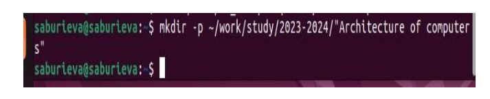
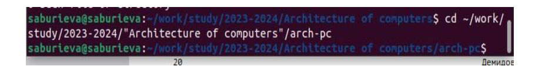

---
## Front matter
title: "Отчёт по лабораторной работе №3"
subtitle: "Дисциплина: Архитектура компьютера"
author: "Буриева Шахзода Акмаловна"

## Generic otions
lang: ru-RU
toc-title: "Содержание"

## Bibliography
bibliography: bib/cite.bib
csl: pandoc/csl/gost-r-7-0-5-2008-numeric.csl

## Pdf output format
toc: true # Table of contents
toc-depth: 2
lof: true # List of figures
lot: true # List of tables
fontsize: 12pt
linestretch: 1.5
papersize: a4
documentclass: scrreprt
## I18n polyglossia
polyglossia-lang:
  name: russian
  options:
	- spelling=modern
	- babelshorthands=true
polyglossia-otherlangs:
  name: english
## I18n babel
babel-lang: russian
babel-otherlangs: english
## Fonts
mainfont: PT Serif
romanfont: PT Serif
sansfont: PT Sans
monofont: PT Mono
mainfontoptions: Ligatures=TeX
romanfontoptions: Ligatures=TeX
sansfontoptions: Ligatures=TeX,Scale=MatchLowercase
monofontoptions: Scale=MatchLowercase,Scale=0.9
## Biblatex
biblatex: true
biblio-style: "gost-numeric"
biblatexoptions:
  - parentracker=true
  - backend=biber
  - hyperref=auto
  - language=auto
  - autolang=other*
  - citestyle=gost-numeric
## Pandoc-crossref LaTeX customization
figureTitle: "Рис."
tableTitle: "Таблица"
listingTitle: "Листинг"
lofTitle: "Список иллюстраций"
lotTitle: "Список таблиц"
lolTitle: "Листинги"
## Misc options
indent: true
header-includes:
  - \usepackage{indentfirst}
  - \usepackage{float} # keep figures where there are in the text
  - \floatplacement{figure}{H} # keep figures where there are in the text
---

# Цель работы

Целью работы является изучить идеологию и применение средств контроля
версий. Приобрести практические навыки по работе с системой git.

# Теоретическое введение

Системы контроля версий (Version Control System, VCS) применяются при работе
нескольких человек над одним проектом. Обычно основное дерево проекта хранится в
локальном или удалённом репозитории, к которому настроен доступ для участников про-
екта. При внесении изменений в содержание проекта система контроля версий позволяет
их фиксировать, совмещать изменения, произведённые разными участниками проекта,
производить откат к любой более ранней версии проекта, если это требуется.
В классических системах контроля версий используется централизованная модель, пред-
полагающая наличие единого репозитория для хранения файлов. Выполнение большинства
функций по управлению версиями осуществляется специальным сервером. Участник про-
екта (пользователь) перед началом работы посредством определённых команд получает
нужную ему версию файлов. После внесения изменений, пользователь размещает новую
версию в хранилище. При этом предыдущие версии не удаляются из центрального хранили-
ща и к ним можно вернуться в любой момент. Сервер может сохранять не полную версию
изменённых файлов, а производить так называемую дельта-компрессию — сохранять только
изменения между последовательными версиями, что позволяет уменьшить объём хранимых
данных.
Системы контроля версий поддерживают возможность отслеживания и разрешения кон-
фликтов, которые могут возникнуть при работе нескольких человек над одним файлом.
Можно объединить (слить) изменения, сделанные разными участниками (автоматически
или вручную), вручную выбрать нужную версию, отменить изменения вовсе или заблоки-
ровать файлы для изменения. В зависимости от настроек блокировка не позволяет другим
пользователям получить рабочую копию или препятствует изменению рабочей копии файла
средствами файловой системы ОС, обеспечивая таким образом, привилегированный доступ
только одному пользователю, работающему с файлом.

Системы контроля версий также могут обеспечивать дополнительные, более гибкие функ-
циональные возможности. Например, они могут поддерживать работу с несколькими вер-
сиями одного файла, сохраняя общую историю изменений до точки ветвления версий и
собственные истории изменений каждой ветви. Кроме того, обычно доступна информация
о том, кто из участников, когда и какие изменения вносил. Обычно такого рода информация
хранится в журнале изменений, доступ к которому можно ограничить.
В отличие от классических, в распределённых системах контроля версий центральный
репозиторий не является обязательным.
Среди классических VCS наиболее известны CVS, Subversion, а среди распределённых —
Git, Bazaar, Mercurial. Принципы их работы схожи, отличаются они в основном синтаксисом
используемых в работе команд.

Система контроля версий Git представляет собой набор программ командной строки.
Доступ к ним можно получить из терминала посредством ввода команды git с различными
опциями.
Благодаря тому, что Git является распределённой системой контроля версий, резервную
копию локального хранилища можно сделать простым копированием или архивацией.

# Выполнение лабораторной работы

Я создала учётную запись на github и заполнила основные данные.

{ #fig:001 width=70% }

Я указала имя и e-mail владельца репозитория.

{ #fig:001 width=70% }

Я настроила uf-8 в выводе сообщений git.

{ #fig:001 width=70% }

Задала имя «master» для начальной ветки.

{ #fig:001 width=70% }

Настроила параметры autocrlf and safecrlf.

{ #fig:001 width=70% }

Сгенерировала пару ключей(открытый и приватный).

{ #fig:001 width=70% }

Скопировала из локальной консоли ключ в буфер обмена

{ #fig:001 width=70% }

Вставила ключ в появившееся на сайте поле и указала для ключа
название saburievaarch.

{ #fig:001 width=70% }

Я создала SSH ключ.

{ #fig:001 width=70% }

Создала каталог для предмета «Архитектура компьютера».

{ #fig:001 width=70% }

Создала репозиторий курса на основе шаблона через web-
интерфейс github.

{ #fig:001 width=70% }

Я перешла в каталог курса.

{ #fig:001 width=70% }

Клонировала созданный репозиторий.

{ #fig:001 width=70% }

Перешла в каталог курса.

{ #fig:001 width=70% }

Удалила лишние файлы и создала необходимые каталоги.

{ #fig:001 width=70% }

Ввела команды git add . and git commit -am.

{ #fig:001 width=70% }

Ввела команду git push и отправила файлы на сервер.

{ #fig:001 width=70% }

Проверила правильность создания иерархии рабочего пространства в
локальном репозитории.

{ #fig:001 width=70% }

Проверила правильность создания иерархии рабочего пространства на
сайте github.

{ #fig:001 width=70% }

# Выводы

Идеология и применение средств контроля изучены. После базовой настройки git
создали иерархию рабочего пространства в локальном репозитории на странице
github.

# Список литературы{.unnumbered}

::: {#refs}
:::
