---
## Front matter
title: "Отчёт по лабораторной работе №3"
subtitle: "Дисциплина: Архитектура компьютера"
author: "Буриева Шахзода Акмаловна"

## Generic otions
lang: ru-RU
toc-title: "Содержание"

## Bibliography
bibliography: bib/cite.bib
csl: pandoc/csl/gost-r-7-0-5-2008-numeric.csl

## Pdf output format
toc: true # Table of contents
toc-depth: 2
lof: true # List of figures
lot: true # List of tables
fontsize: 12pt
linestretch: 1.5
papersize: a4
documentclass: scrreprt
## I18n polyglossia
polyglossia-lang:
  name: russian
  options:
	- spelling=modern
	- babelshorthands=true
polyglossia-otherlangs:
  name: english
## I18n babel
babel-lang: russian
babel-otherlangs: english
## Fonts
mainfont: PT Serif
romanfont: PT Serif
sansfont: PT Sans
monofont: PT Mono
mainfontoptions: Ligatures=TeX
romanfontoptions: Ligatures=TeX
sansfontoptions: Ligatures=TeX,Scale=MatchLowercase
monofontoptions: Scale=MatchLowercase,Scale=0.9
## Biblatex
biblatex: true
biblio-style: "gost-numeric"
biblatexoptions:
  - parentracker=true
  - backend=biber
  - hyperref=auto
  - language=auto
  - autolang=other*
  - citestyle=gost-numeric
## Pandoc-crossref LaTeX customization
figureTitle: "Рис."
tableTitle: "Таблица"
listingTitle: "Листинг"
lofTitle: "Список иллюстраций"
lotTitle: "Список таблиц"
lolTitle: "Листинги"
## Misc options
indent: true
header-includes:
  - \usepackage{indentfirst}
  - \usepackage{float} # keep figures where there are in the text
  - \floatplacement{figure}{H} # keep figures where there are in the text
---

# Цель работы

Освоить процесс оформления отчётов лабораторных работ с помощью разметки Markdown, а также ознакомиться с основными возможностями разметки Markdown.

# Теоретическое введение
Markdown- это простой язык разметки, используемый для создания форматированного текста (например, HTML) с помощью текстового редактора. Он позволяет добавлять к тексту базовое форматирование, используя символы, известные и доступные на всех клавиатурах.

Чтобы создать заголовок, надо использовать знак #.

Чтобы задать для текста полужирное начертание, надо заключить его в двойные звёздочки.

Чтобы задать для текста курсивное начертание, надо заключить его в одинарные звёздочки.

Чтобы задать для текста полужирное и курсивное начертание, надо заключить его в тройные
звёздочки.

Блоки цитирования создаются с помощью символа >.

Markdown поддерживает как встраивание фрагментов кода в предложение, так и их разме-
щение между предложениями в виде отдельных ограждённых блоков. Ограждённые блоки
кода — это простой способ выделить синтаксис для фрагментов кода.

В Markdown вставить изображение в документ можно с помощью непосредственного
указания адреса изображения.

# Выполнение лабораторной работы

Я открыла терминал, перешла в каталог курса сформированный при выполнении лабораторной работы
№2 

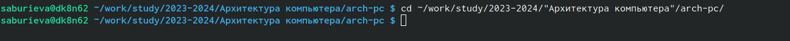{ #fig:001 width=70% }

Обновила локальный репозиторий, скачав изменения из удаленного репозитория с помо-
щью команды git pull. 

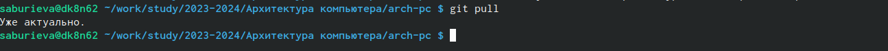{ #fig:002 width=70% }

Перешла в каталог с шаблоном отчета по лабораторной работе № 3 

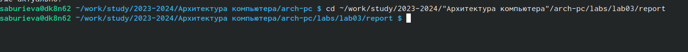{ #fig:003 width=70% }

Ввела команду make и провела компиляцию шаблона с использованием Makefile. 

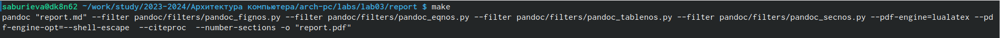{ #fig:004 width=70% }

Открыла и проверила корректность полученных файлов

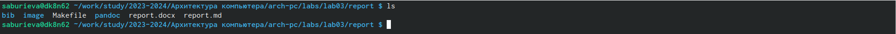{ #fig:005 width=70% }

Ввела команду make clean для того чтобы удалить полученные файлы с использованием Makefile.

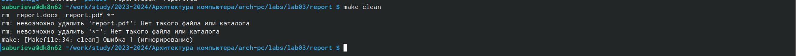{ #fig:006 width=70% }

Проверили, что после этой команды файлы report.pdf и report.docx были удалены.

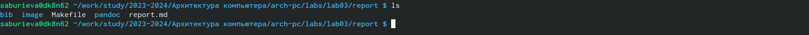{ #fig:007 width=70% }

Открыла файл report.md c помощью текстового редактора gedit и внимательно изучила структуру этого файла.

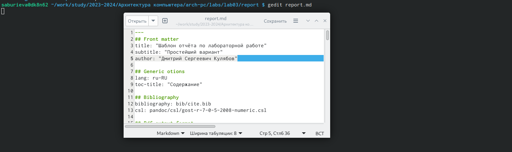{ #fig:008 width=70% }

Заполнила отчет №3 и скомпилировала отчет с использованием Makefile. Проверила кор-
ректность полученных файлов.Отчёт в трёх форматах предоставлен.

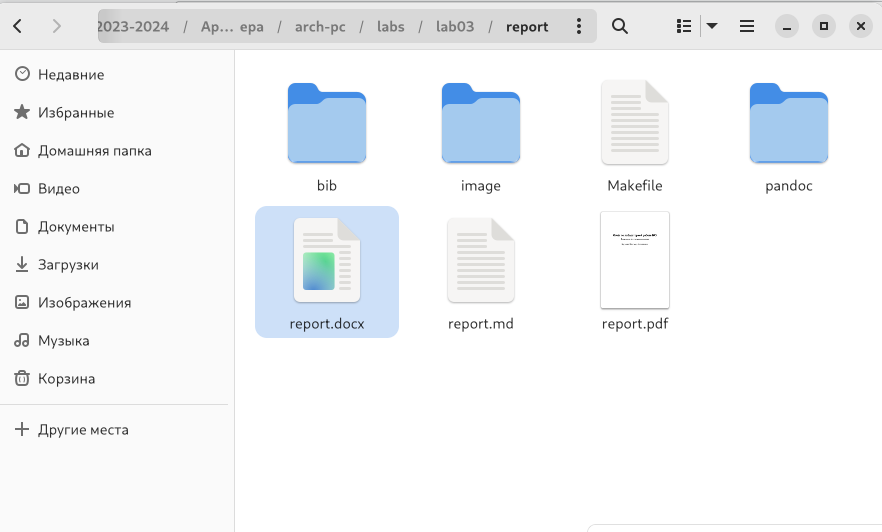{ #fig:009 width=70% }

Загрузила файлы на github.
 

#Выполнение задания для самостоятельной работы

В соответсвующем каталоге сделала отчёт по лабораторной работе №2 в формате
Markdown и представила их в 3-ёх форматах.

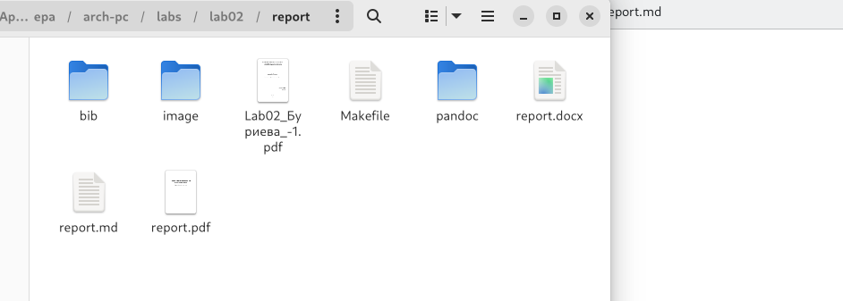{ #fig:009 width=70% }

Загрузила файлы на Github.

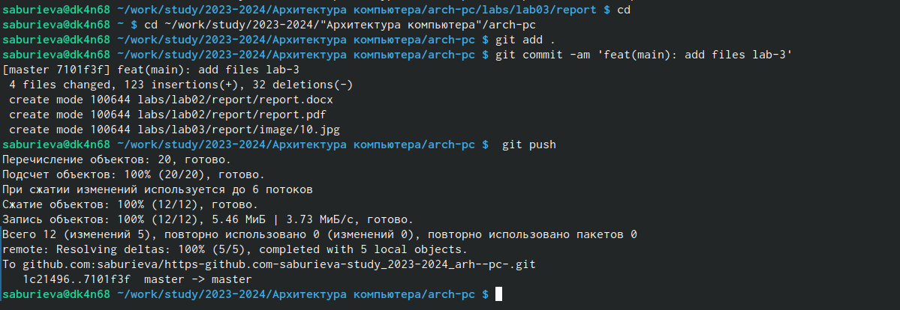{ #fig:009 width=70% }

# Выводы

Здесь кратко описываются итоги проделанной работы.

::: {#refs}
:::
