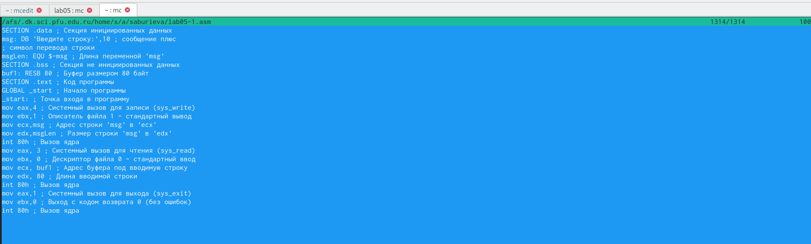
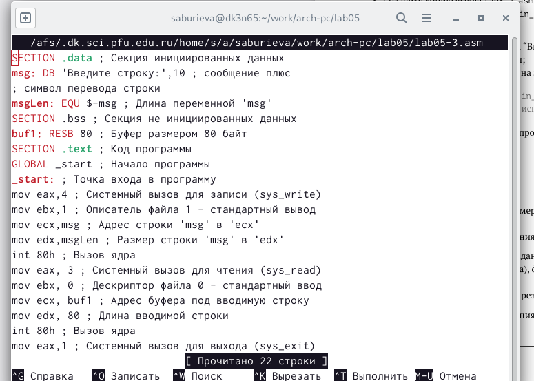

---
## Front matter
title: "Отчёт по лабораторной работе №5"
subtitle: "Дисциплина: Архитектура компьютера"
author: "Буриева Шахзода Акмаловна"

## Generic otions
lang: ru-RU
toc-title: "Содержание"

## Bibliography
bibliography: bib/cite.bib
csl: pandoc/csl/gost-r-7-0-5-2008-numeric.csl

## Pdf output format
toc: true # Table of contents
toc-depth: 2
lof: true # List of figures
lot: true # List of tables
fontsize: 12pt
linestretch: 1.5
papersize: a4
documentclass: scrreprt
## I18n polyglossia
polyglossia-lang:
  name: russian
  options:
	- spelling=modern
	- babelshorthands=true
polyglossia-otherlangs:
  name: english
## I18n babel
babel-lang: russian
babel-otherlangs: english
## Fonts
mainfont: PT Serif
romanfont: PT Serif
sansfont: PT Sans
monofont: PT Mono
mainfontoptions: Ligatures=TeX
romanfontoptions: Ligatures=TeX
sansfontoptions: Ligatures=TeX,Scale=MatchLowercase
monofontoptions: Scale=MatchLowercase,Scale=0.9
## Biblatex
biblatex: true
biblio-style: "gost-numeric"
biblatexoptions:
  - parentracker=true
  - backend=biber
  - hyperref=auto
  - language=auto
  - autolang=other*
  - citestyle=gost-numeric
## Pandoc-crossref LaTeX customization
figureTitle: "Рис."
tableTitle: "Таблица"
listingTitle: "Листинг"
lofTitle: "Список иллюстраций"
lotTitle: "Список таблиц"
lolTitle: "Листинги"
## Misc options
indent: true
header-includes:
  - \usepackage{indentfirst}
  - \usepackage{float} # keep figures where there are in the text
  - \floatplacement{figure}{H} # keep figures where there are in the text
---

# Цель работы

Приобрести практические навыки для работы в Midnight Commander. Освоить инструкции
языка ассемблера mov и int.

# Теоретическое введение

Midnight Commander (или просто mc) — это программа, которая позволяет просматривать
структуру каталогов и выполнять основные операции по управлению файловой системой,
т.е. mc является файловым менеджером. Midnight Commander позволяет сделать работу с
файлами более удобной и наглядной.Для активации оболочки Midnight Commander достаточно ввести в командной строке mc и
нажать клавишу Enter. В Midnight Commander используются функциональные клавиши F1 — F10 , к которым
привязаны часто выполняемые операции.

Программа на языке ассемблера NASM, как правило, состоит из трёх секций: секция кода
программы (SECTION .text), секция инициированных (известных во время компиляции)
данных (SECTION .data) и секция неинициализированных данных (тех, под которые во
время компиляции только отводится память, а значение присваивается в ходе выполнения
программы) (SECTION .bss).

Директивы используются для объявления простых переменных и для объявления масси-
вов. Для определения строк принято использовать директиву DB в связи с особенностями
хранения данных в оперативной памяти.

Простейший диалог с пользователем требует наличия двух функций — вывода текста на
экран и ввода текста с клавиатуры. Простейший способ вывести строку на экран — использо-
вать системный вызов write. Этот системный вызов имеет номер 4, поэтому перед вызовом
инструкции int необходимо поместить значение 4 в регистр eax. Первым аргументом write,
помещаемым в регистр ebx, задаётся дескриптор файла. Для вывода на экран в качестве
дескриптора файла нужно указать 1 (это означает «стандартный вывод», т. е. вывод на экран).
Вторым аргументом задаётся адрес выводимой строки (помещаем его в регистр ecx, напри-
мер, инструкцией mov ecx, msg). Строка может иметь любую длину. Последним аргументом
(т.е. в регистре edx) должна задаваться максимальная длина выводимой строки.
Для ввода строки с клавиатуры можно использовать аналогичный системный вызов read.
Его аргументы – такие же, как у вызова write, только для «чтения» с клавиатуры используется
файловый дескриптор 0 (стандартный ввод).
Системный вызов exit является обязательным в конце любой программы на языке ассем-
блер. Для обозначения конца программы перед вызовом инструкции int 80h необходимо
поместить в регистр еах значение 1, а в регистр ebx код завершения 0.

# Выполнение лабораторной работы

Я открыла Midnight Commander в терминале.

{ #fig:001 width=70% }

Пользуясь клавишами вверх , вниз и Enter перешла в каталог ~/work/arch-pc созданный при выполнении лабораторной работы №4.

{ #fig:001 width=70% }

С помощью функциональной клавиши F7 создала папку lab05.

{ #fig:001 width=70% }

Я перешла в созданный каталог.

{ #fig:001 width=70% }

Пользуясь строкой ввода и командой touch создала файл lab5-1.asm.

{ #fig:001 width=70% }

С помощью функциональной клавиши F4 открыла файл lab05-1.asm для редактирования во встроенном редакторе nano.

{ #fig:001 width=70% }

Ввела текст программы из листинга, сохранила изменения и закрыла файл.

{ #fig:001 width=70% }

С помощью функциональной клавиши F3 открыла файл lab05-1.asm для просмотра. Убедилась, что файл содержит текст программы.

{ #fig:001 width=70% }

Оттранслировала текст программы lab05-1.asm в объектный файл. Выполнила компоновку объектного файла и запустила получившийся исполняемый файл. Программа вывела строку 'Введите строку:' и ожидала ввода с клавиатуры. На запрос "Введите строку" я ввела свои ФИО.

{ #fig:001 width=70% }

Скачала файл in_out.asm со страницы курса в ТУИС.Он сохранился в каталоге "Загрузки".

{ #fig:001 width=70% }

C помощью функциональной клавиши F5 коипрую файл in_out.asm из каталога "Загрузки" в созданный каталог lab05.

{ #fig:001 width=70% }

С помощью функциональной клавиши F6 создала копию файла lab05-1.asm с именем lab05-2.asm. Выделила файл lab05-1.asm, нажала клавишу F6 , ввела имя файла lab05-2.asm и нажала клавишу Enter. 

{ #fig:001 width=70% }

Исправила текст программы в файле lab05-2.asm с использование подпрограмм из внешнего файла in_out.asm (использовала подпрограммы sprintLF, sread и quit) в соответствии с листингом.Создала исполняемый файл и проверила его работу.

{ #fig:001 width=70% }

Оттранслировала текст программы lab05-2.asm в объектный файл. Выполнила компоновку объектного файла и запустила получившийся исполняемый файл. Программа вывела строку 'Введите строку:' и ожидала ввода с клавиатуры. На запрос "Введите строку" я ввела свои ФИО.

{ #fig:001 width=70% }

В файле lab5-2.asm заменила подпрограмму sprintLF на sprint. Создала исполняе-
мый файл и проверила его работу.

{ #fig:001 width=70% }

Снова оттранслировала текст программы lab05-2.asm в объектный файл. Выполнила компоновку объектного файла и запустила получившийся исполняемый файл. Программа вывела строку 'Введите строку:' и ожидала ввода с клавиатуры. На запрос "Введите строку" я ввела свои ФИО.

{ #fig:001 width=70% }

Разница между первым исполняемым файлом и вторыи сполняемым файлом в том, что запуск первого запрашивает вводн с новой строки, а программа, которая исполняется при запуске второго,запрашивает ввод без переноса а новую строку, потому что в этом именно заключется различие между подпрограммами sprintLF и sprint.

#Выполнение заданий для самостоятельной работы

Создала копию файла lab5-1.asm с именем lab05-3.asm с помощью функциональной строки F5.

{ #fig:001 width=70% }

Ввела в эту программу некторые измнения.

{ #fig:001 width=70% }

Оттранслировала текст программы lab05-3.asm в объектный файл. Выполнила компоновку объектного файла и запустила получившийся исполняемый файл.

{ #fig:001 width=70% }

Программа вывела строку 'Введите строку:' и ожидала ввода с клавиатуры. На запрос "Введите строку" я ввела свою фамилию.

{ #fig:001 width=70% }

Создала копию файла lab5-2.asm с именем lab05-3-1.asm с помощью функциональной строки F5.

{ #fig:001 width=70% }

Оттранслировала текст программы lab05-3-1.asm в объектный файл. Выполнила компоновку объектного файла и запустила получившийся исполняемый файл.Создала исполняемый файл и проверила его работу.

{ #fig:001 width=70% }

Отправила лабораторную работу №5 на github.

# Выводы

Я приобрела  практические навыки для работы в Midnight Commander и освоила инструкции языка ассемблера mov и int.

# Список литературы{.unnumbered}

::: {#refs}
:::
