---
## Front matter
title: "Отчёт по лабораторной работе №6"
subtitle: "Дисциплина: Архитектура компьютера"
author: "Буриева Шахзода Акмаловна"

## Generic otions
lang: ru-RU
toc-title: "Содержание"

## Bibliography
bibliography: bib/cite.bib
csl: pandoc/csl/gost-r-7-0-5-2008-numeric.csl

## Pdf output format
toc: true # Table of contents
toc-depth: 2
lof: true # List of figures
lot: true # List of tables
fontsize: 12pt
linestretch: 1.5
papersize: a4
documentclass: scrreprt
## I18n polyglossia
polyglossia-lang:
  name: russian
  options:
	- spelling=modern
	- babelshorthands=true
polyglossia-otherlangs:
  name: english
## I18n babel
babel-lang: russian
babel-otherlangs: english
## Fonts
mainfont: PT Serif
romanfont: PT Serif
sansfont: PT Sans
monofont: PT Mono
mainfontoptions: Ligatures=TeX
romanfontoptions: Ligatures=TeX
sansfontoptions: Ligatures=TeX,Scale=MatchLowercase
monofontoptions: Scale=MatchLowercase,Scale=0.9
## Biblatex
biblatex: true
biblio-style: "gost-numeric"
biblatexoptions:
  - parentracker=true
  - backend=biber
  - hyperref=auto
  - language=auto
  - autolang=other*
  - citestyle=gost-numeric
## Pandoc-crossref LaTeX customization
figureTitle: "Рис."
tableTitle: "Таблица"
listingTitle: "Листинг"
lofTitle: "Список иллюстраций"
lotTitle: "Список таблиц"
lolTitle: "Листинги"
## Misc options
indent: true
header-includes:
  - \usepackage{indentfirst}
  - \usepackage{float} # keep figures where there are in the text
  - \floatplacement{figure}{H} # keep figures where there are in the text
---

# Цель работы

Освоить арифметических инструкций языка ассемблера NASM.

# Теоретическое введение

Большинство инструкций на языке ассемблера требуют обработки операндов. Адрес опе-
ранда предоставляет место, где хранятся данные, подлежащие обработке. Это могут быть
данные хранящиеся в регистре или в ячейке памяти. Далее рассмотрены все существующие
способы задания адреса хранения операндов – способы адресации.
Схема команды целочисленного сложения add (от англ. addition - добавление) выполняет
сложение двух операндов и записывает результат по адресу первого операнда.
Довольно часто при написании программ встречается операция прибавления или вычита-
ния единицы. Прибавление единицы называется инкрементом, а вычитание — декрементом.
Для этих операций существуют специальные команды: inc (от англ. increment) и dec (от англ.
decrement), которые увеличивают и уменьшают на 1 свой операнд.

Ввод информации с клавиатуры и вывод её на экран осуществляется в символьном виде.
Кодирование этой информации производится согласно кодовой таблице символов ASCII.
ASCII – сокращение от American Standard Code for Information Interchange (Американский
стандартный код для обмена информацией). Согласно стандарту ASCII каждый символ
кодируется одним байтом.
Расширенная таблица ASCII состоит из двух частей. Первая (символы с кодами 0-127)
является универсальной (см. Приложение.), а вторая (коды 128-255) предназначена для
специальных символов и букв национальных алфавитов и на компьютерах разных типов
может меняться.
Среди инструкций NASM нет такой, которая выводит числа (не в символьном виде). По-
этому, например, чтобы вывести число, надо предварительно преобразовать его цифры в
ASCII-коды этих цифр и выводить на экран эти коды, а не само число. Если же выводить число
на экран непосредственно, то экран воспримет его не как число, а как последовательность
ASCII-символов – каждый байт числа будет воспринят как один ASCII-символ – и выведет на
экран эти символы.
Аналогичная ситуация происходит и при вводе данных с клавиатуры. Введенные дан-
ные будут представлять собой символы, что сделает невозможным получение корректного
результата при выполнении над ними арифметических операций.
Для решения этой проблемы необходимо проводить преобразование ASCII символов в
числа и обратно.

# Выполнение лабораторной работы

Создала каталог для программам лабораторной работы № 6, перешла в него и
создала файл lab6-1.asm

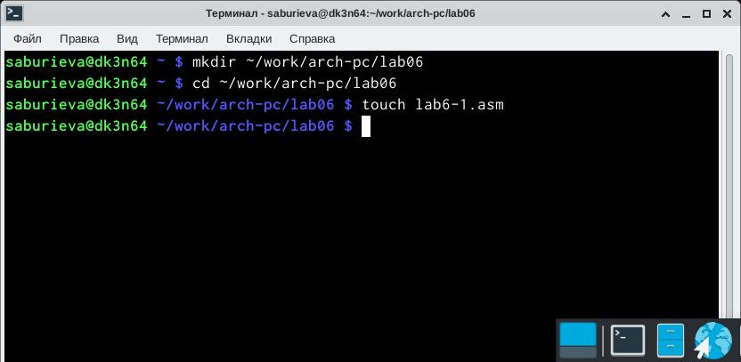{ #fig:001 width=70% }

Перед созданием исполняемого файла создала копию файла in_out.asm в каталоге ~/work/arch-pc/lab06.

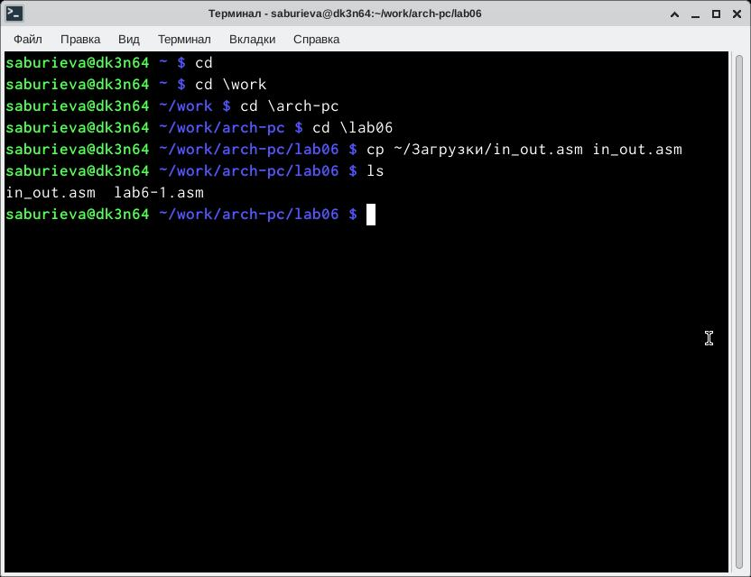{ #fig:001 width=70% }

Ввела в файл lab6-1.asm текст программы из данного листинга и сохранила его.

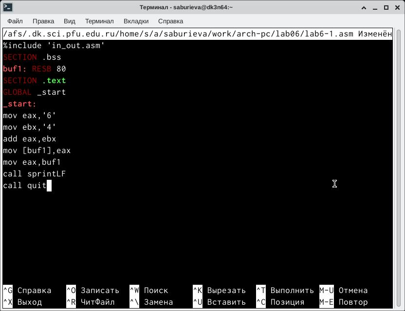{ #fig:001 width=70% }

Создала исполняемый файл и запустила его.Программа вывела символ j,потому что он соответствует сумме двоичных кодов символов 4 и 6 по системе ASCII.

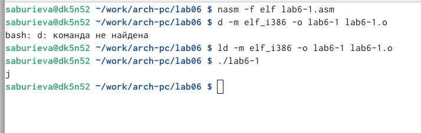{ #fig:001 width=70% }

Изменила текст программы.

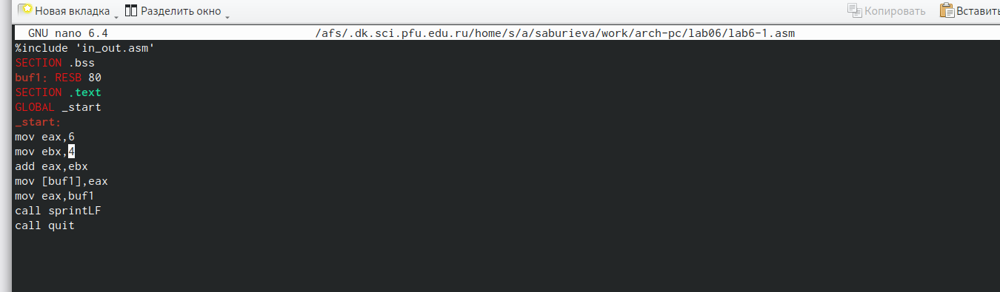{ #fig:001 width=70% }

Создала изменённый исполняемый файл и запустила его.Программа вывела символ перевода строки, потому что он соответствует коду 10=6+4 по системе ASII.

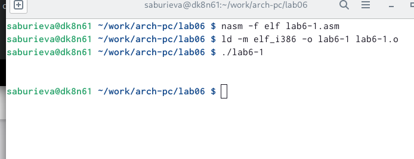{ #fig:001 width=70% }
 
Создала файл lab6-2.asm в каталоге ~/work/arch-pc/lab06.
 
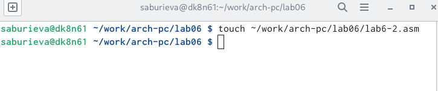{ #fig:001 width=70% }

Ввела в созданный файл lab6-2.asm текст программы из листинга.

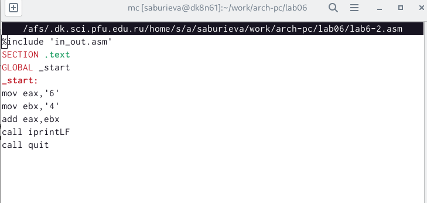{ #fig:001 width=70% }

Создала исполняемый файл и запустила его.Программа вывела, а именно сложение кодов символов "6" и "4".В итоге получилось 106.

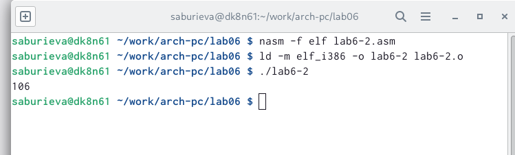{ #fig:001 width=70% }

Далее опять изменила текст программы lab6-2.asm.

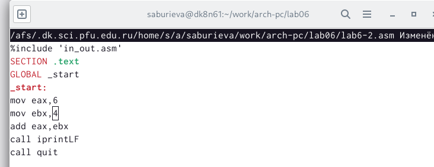{ #fig:001 width=70% }

Создала изменённый исполняемый файл lab6-2.asm и запустила его. Программа вывела сложение именно цифр.

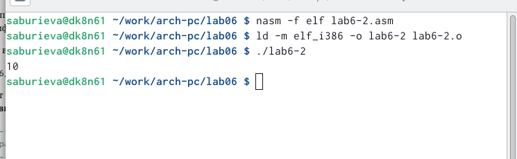{ #fig:001 width=70% }

Заменила функцию iprintLF на iprint в данном файле.

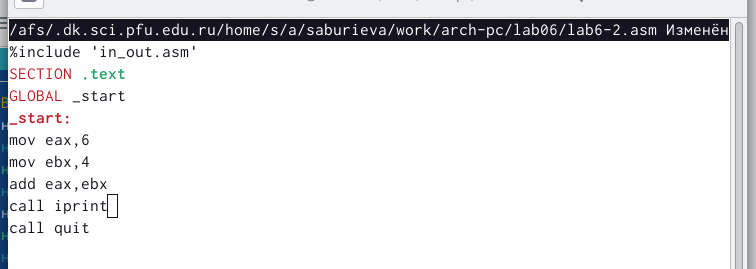{ #fig:001 width=70% }

Создала изменённый исполняемый файл lab6-2.asm и запустила его.Вывод остался таким же, потому что символьный переносстрок не отображался, когда программа выполнялась с ограничением iprintLF, а iprint не добавлял к завершению символьный перенос строк, в отличие от iprintLF.

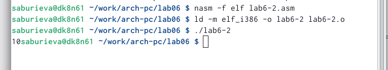{ #fig:001 width=70% }

Создала файл lab6-3.asm в каталоге ~/work/arch-pc/lab06.

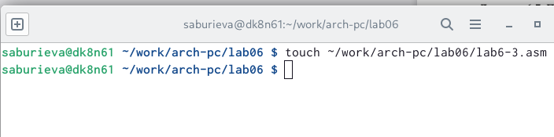{ #fig:001 width=70% }

Внимательно изучила текст программы из листинга и ввела в lab6-3.asm.

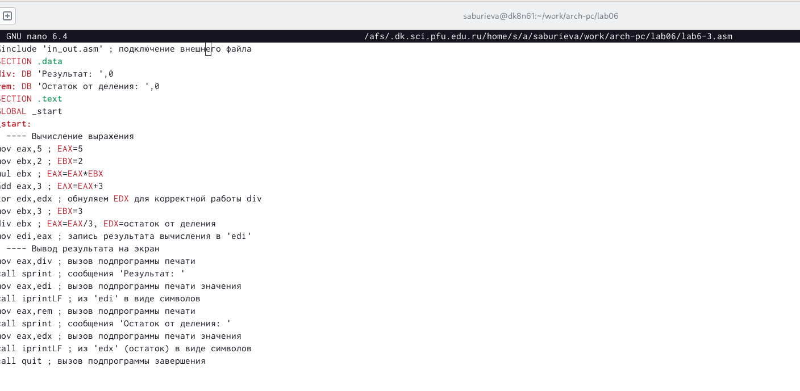{ #fig:001 width=70% }

Создала исполняемый файл и запустила его.На экран вывелся ответ.

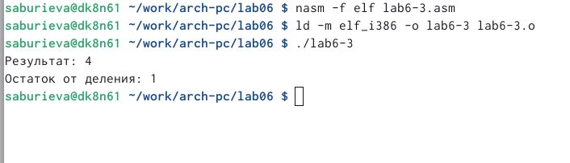{ #fig:001 width=70% }

Изменила текст программы для вычисления выражения 𝑓(𝑥) = (4 ∗ 6 + 2)/5.

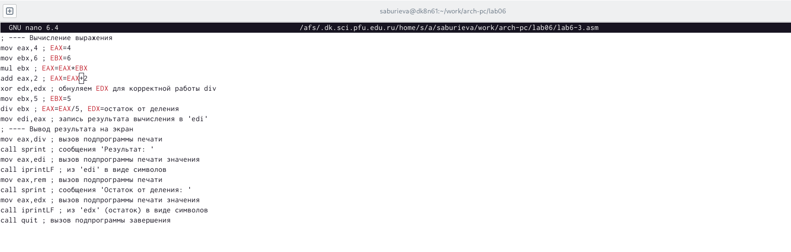{ #fig:001 width=70% }

Создала изменённый исполняемый файл для алгебраического вычисления и запустила его.

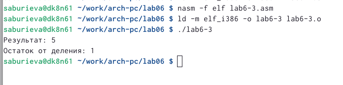{ #fig:001 width=70% }

Создала файл variant.asm в каталоге ~/work/arch-pc/lab06.

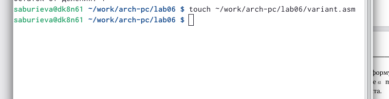{ #fig:001 width=70% }

Внимательно изучила текст программы из листинга  и ввела в файл variant.asm.

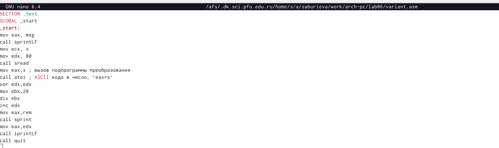{ #fig:001 width=70% }

Создала файл variant.asm и запустила его.На запрос ввести студенческий билет,ввела номер своего студенческого билета.И мне выпало число 4.

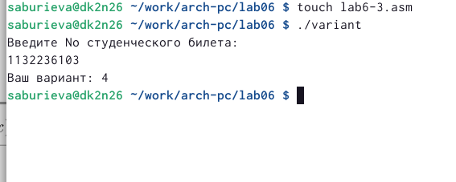{ #fig:001 width=70% }

# Выполнение заданий для самостоятельной работы

Создала файл lab6-4.asm в каталоге ~/work/arch-pc/lab06.

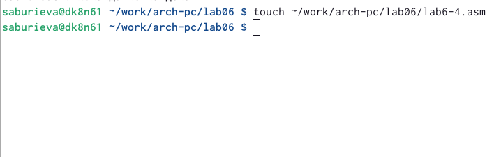{ #fig:001 width=70% }

Ввела текст программы для алгебраического расчёта.

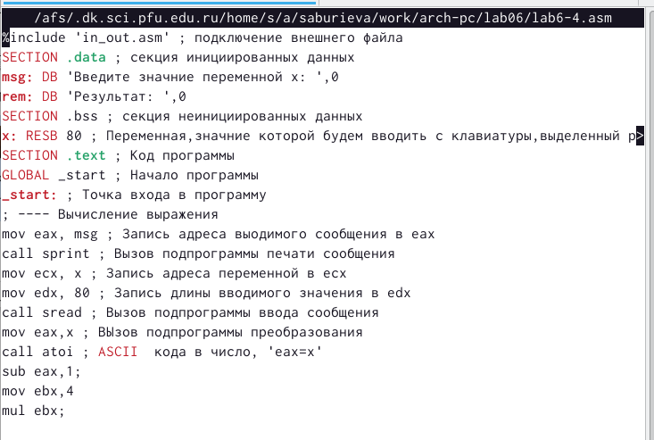{ #fig:001 width=70% }

На рисунке показан сам текст моей программы,который я вводила.

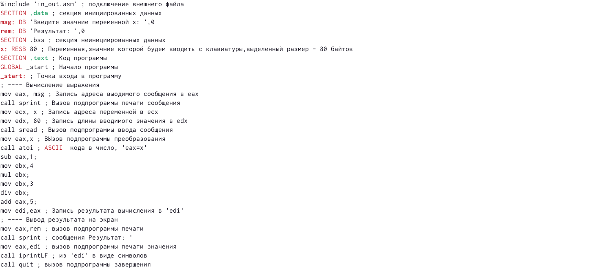{ #fig:001 width=70% }

Создала исполняемый файл и запустила его.На запрос "Введите значение переменной x" ввела число 4.А затем ввела число 10.На экран вывелись оба значения x.

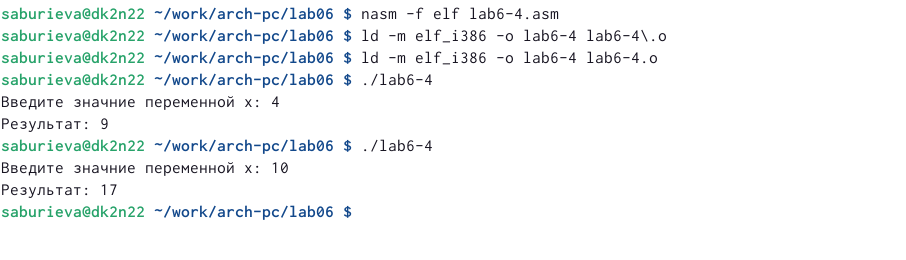{ #fig:001 width=70% }

# Ответы на вопросы.

1) Для вывода сообщения "Ваш вариант" предоставляются следующие  строки кода.

{ #fig:001 width=70% }

2)Инструкция mov ecx,x используется для того чтобы поставить адрес вводимой строки x в регистр, ecx mov edx,80-это запись в регистр edx длины вводимой строки, call sread-это вызов подпрограммы из внешнего файла, вводы сообщений с клавиатуры.

3)Инструкция "call atoi" используется для вызова подпрограмм из внешнего файла,преобразующий символы ASII-кода в имена чисел и записывающая результат в регистр eax.

4)Эти строки листинга 6.4 отвечают за вычисления варианта.

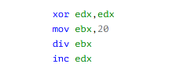{ #fig:001 width=70% }

5)При выполнении инструкции остаток деления div ebx записывается в регистр edx.

6) Инструкция “inc edx” используется для увеличения значения регистра edx на 1.

7)Для вывода результатов на экране используются эти коды.

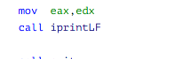{ #fig:001 width=70% }

Отправила все файлы на github.

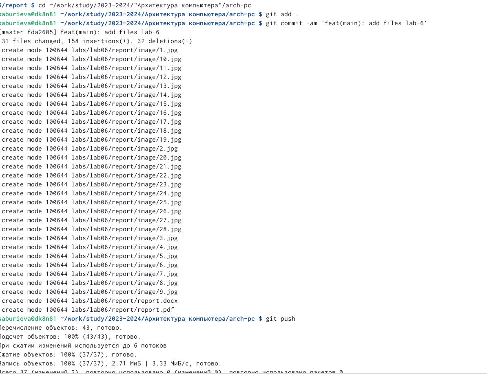{ #fig:001 width=70% }

# Выводы

Я освоила арифметических инструкций языка ассемблера NASM.

# Список литературы{.unnumbered}

::: {#refs}
:::
