---
## Front matter
title: "Отчёт по лабораторной работе №7"
subtitle: "Дисциплина: Архитектура компьютера"
author: "Буриева Шахзода Акмаловна"

## Generic otions
lang: ru-RU
toc-title: "Содержание"

## Bibliography
bibliography: bib/cite.bib
csl: pandoc/csl/gost-r-7-0-5-2008-numeric.csl

## Pdf output format
toc: true # Table of contents
toc-depth: 2
lof: true # List of figures
lot: true # List of tables
fontsize: 12pt
linestretch: 1.5
papersize: a4
documentclass: scrreprt
## I18n polyglossia
polyglossia-lang:
  name: russian
  options:
	- spelling=modern
	- babelshorthands=true
polyglossia-otherlangs:
  name: english
## I18n babel
babel-lang: russian
babel-otherlangs: english
## Fonts
mainfont: PT Serif
romanfont: PT Serif
sansfont: PT Sans
monofont: PT Mono
mainfontoptions: Ligatures=TeX
romanfontoptions: Ligatures=TeX
sansfontoptions: Ligatures=TeX,Scale=MatchLowercase
monofontoptions: Scale=MatchLowercase,Scale=0.9
## Biblatex
biblatex: true
biblio-style: "gost-numeric"
biblatexoptions:
  - parentracker=true
  - backend=biber
  - hyperref=auto
  - language=auto
  - autolang=other*
  - citestyle=gost-numeric
## Pandoc-crossref LaTeX customization
figureTitle: "Рис."
tableTitle: "Таблица"
listingTitle: "Листинг"
lofTitle: "Список иллюстраций"
lotTitle: "Список таблиц"
lolTitle: "Листинги"
## Misc options
indent: true
header-includes:
  - \usepackage{indentfirst}
  - \usepackage{float} # keep figures where there are in the text
  - \floatplacement{figure}{H} # keep figures where there are in the text
---

# Цель работы
Целью работы изучить команды условного и безусловного переходов. Приобрести навыки написания
программ с использованием переходов. Познакомиться с назначением и структурой файла
листинга.

# Теоретическое введение

Для реализации ветвлений в ассемблере используются так называемые команды передачи управления или команды перехода.Безусловный переход выполняется инструкцией jmp (от англ. jump – прыжок), которая
включает в себя адрес перехода, куда следует передать управление.Адрес перехода может быть либо меткой, либо адресом области памяти, в которую предварительно помещен указатель перехода. Кроме того, в качестве операнда можно использовать имя регистра, в таком случае переход будет осуществляться по адресу, хранящемуся в этом регистре.Как отмечалось выше, для условного перехода необходима проверка какого-либо условия. В ассемблере команды условного перехода вычисляют условие перехода анализируя флаги из регистра флагов.

Флаг – это бит, принимающий значение 1 («флаг установлен»), если выполнено некоторое условие, и значение 0 («флаг сброшен») в противном случае. Флаги работают независимо друг от друга, и лишь для удобства они помещены в единый регистр — регистр флагов, отражающий текущее состояние процессора. В следующей таблице указано положение битовых флагов в регистре флагов.Инструкция cmp является одной из инструкций, которая позволяет сравнить операнды и выставляет флаги в зависимости от результата сравнения. Инструкция cmp является командой сравнения двух операндов и имеет такой же формат, как и команда вычитания.

Листинг (в рамках понятийного аппарата NASM) — это один из выходных файлов, создаваемых транслятором. Он имеет текстовый вид и нужен при отладке программы, так как кроме строк самой программы он содержит дополнительную информацию.

# Выполнение лабораторной работы

Создала каталог для программам лабораторной работы № 7, перешла в него и со-
здала файл lab7-1.asm

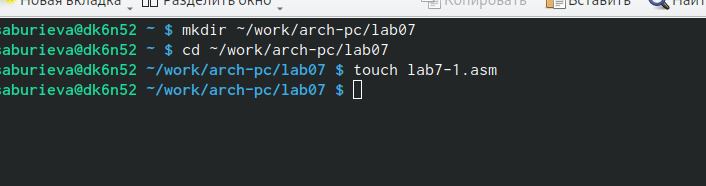{ #fig:001 width=70% }

Рассмотрела пример программы с использованием инструкции jmp. Ввела в файл lab7-1.asm текст программы из листинга.

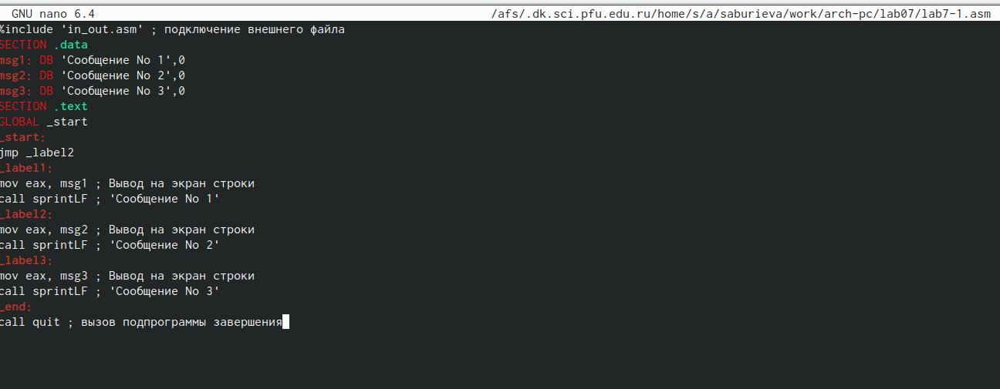{ #fig:001 width=70% }

Создала исполняемый файл и запустила его.

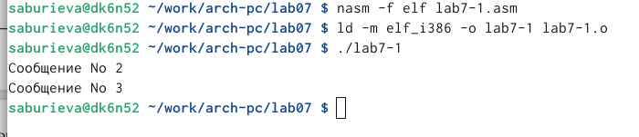{ #fig:001 width=70% }

Изменила программу таким образом, чтобы она выводила сначала ‘Сообщение № 2’, потом ‘Сообщение № 1’ и завершала работу. Для этого в текст программы после вывода сообщения № 2 добавила инструкцию jmp с меткой _label1 (т.е. переход к инструкциям вывода сообщения № 1) и после вывода сообщения № 1 добавила инструкцию jmp с меткой _end (т.е. переход к инструкции call quit). Измените текст программы в соответствии с листингом.
 
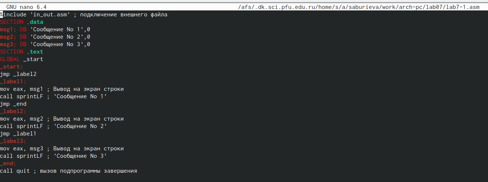{ #fig:001 width=70% }

Создала исполняемый файл и проверила его работу.

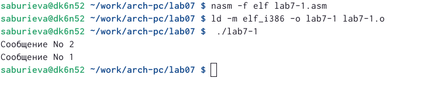{ #fig:001 width=70% }

Изменила текст программы добавив или изменив инструкции jmp, чтобы вывод программы сначала выводил на экран сообщение 3, потом сообщение 2 и затем сообщение 1.

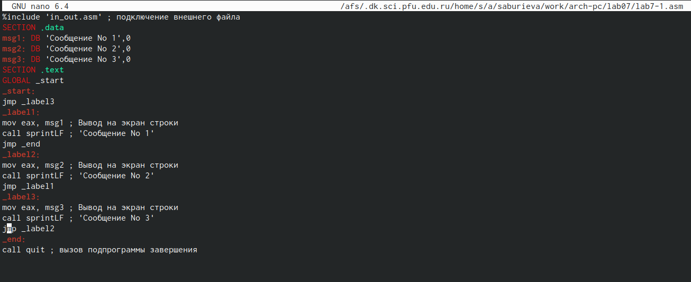{ #fig:001 width=70% }

Создала исполняемый файл и проверила его работу.

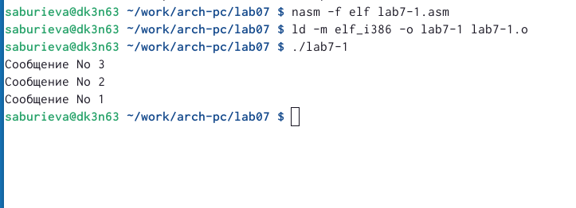{ #fig:001 width=70% }

Создала файл lab7-2.asm в каталоге ~/work/arch-pc/lab07.

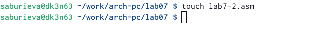{ #fig:001 width=70% }

 Внимательно изучила текст программы из листинга и ввела в lab7-2.asm.
 
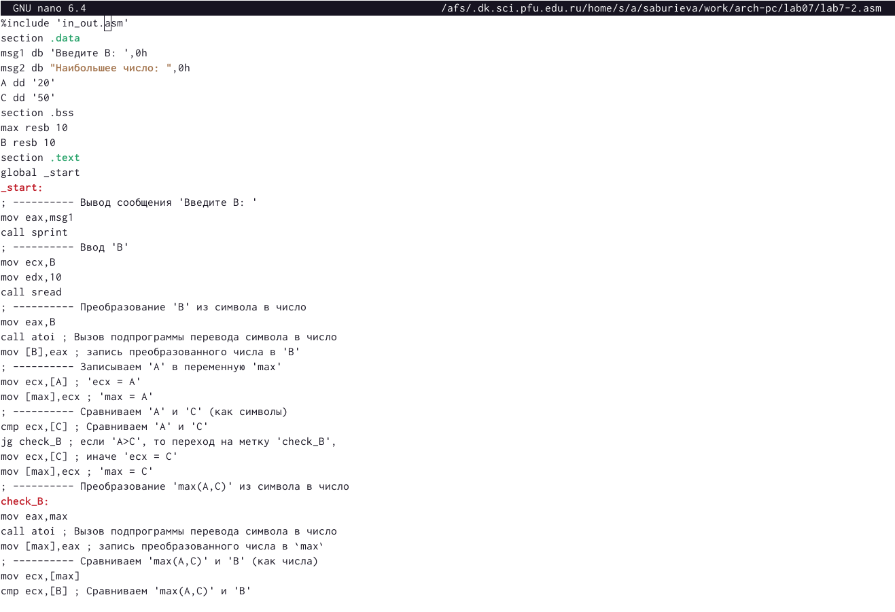{ #fig:001 width=70% }
 
 Создала исполняемый файл и проверила его работу для разных значений B.
 
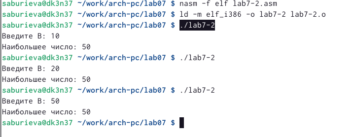{ #fig:001 width=70% }
 
Создала файл листинга для программы из файла lab7-2.asm.

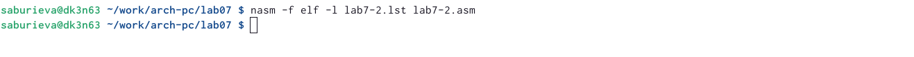{ #fig:001 width=70% }

Открыла файл листинга lab7-2.lst с помощью любого текстового редактора, например
mcedit.

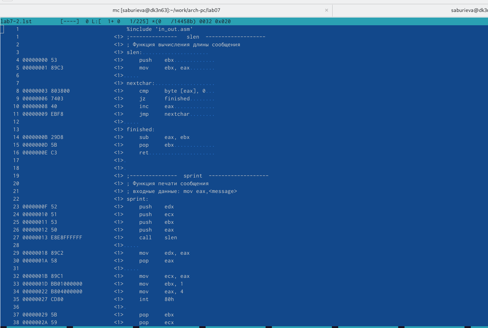{ #fig:001 width=70% }

В сторке 17 содержится номер строки [17],адрес строки [000000F2],машинный код [B9] и исходный текст программы [mov ecx,B].В строке 18 содержится номер строки [18],адрес строки [000000F7],машинный код [BA0A000000] и исходный текст программы [mov edx,10].В строке номер 19 содержится номер строки [19],адрес строки [000000FC],машинный код [E842FFFFFF] и исходный текст программы [call sread].

Открыла файл с программой lab7-2.asm и в любой инструкции с двумя операндами удалила один операнд. Выполнила трансляцию с получением файла листинга.

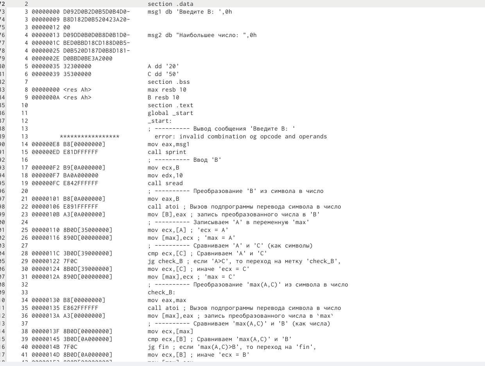{ #fig:001 width=70% }

# Задание для самостоятельной работы

Спрева создала файл lab7-3.asm для написания программы задания самостоятельного выполения

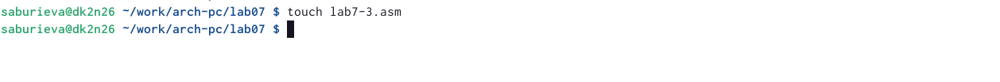{ #fig:001 width=70% }

Написала программу нахождения наименьшей из 3 целочисленных переменных a,b и c.Значения переменных выбрала из первой таблицы в соответствии с вариантом, полученным
при выполнении лабораторной работы No 6( вариант 4 ).

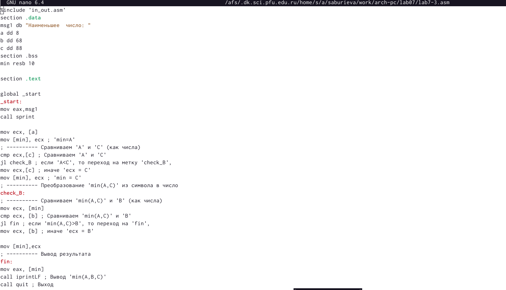{ #fig:001 width=70% }

Создала исполняемый файл и проверила его работу.

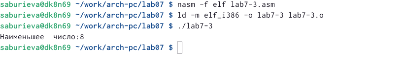{ #fig:001 width=70% }

Cоздала файл lab7-4.asm.Написала программу которая для введенных с клавиатуры значений x и a вычисляет значение заданной функции f(x) и выводит результат вычислений.Создала исполняемый файл и проверила его работу.

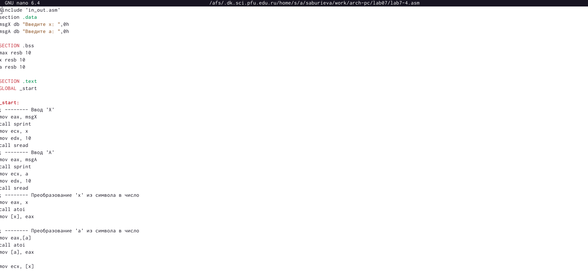{ #fig:001 width=70% }

# Вывод

Изучила команды условного и безусловного переходов. Приобрела навыки написания
программ с использованием переходов. Познакомилась с назначением и структурой файла
листинга.

::: {#refs}
:::
