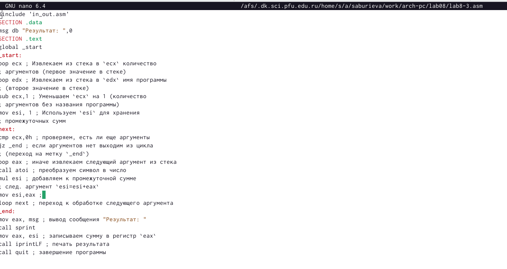

---
## Front matter
title: "Отчёт по лабораторной работе №8"
subtitle: "Отчёт по лабораторной работе №8"
author: "Буриева Шахзода Акмаловна"

## Generic otions
lang: ru-RU
toc-title: "Содержание"

## Bibliography
bibliography: bib/cite.bib
csl: pandoc/csl/gost-r-7-0-5-2008-numeric.csl

## Pdf output format
toc: true # Table of contents
toc-depth: 2
lof: true # List of figures
lot: true # List of tables
fontsize: 12pt
linestretch: 1.5
papersize: a4
documentclass: scrreprt
## I18n polyglossia
polyglossia-lang:
  name: russian
  options:
	- spelling=modern
	- babelshorthands=true
polyglossia-otherlangs:
  name: english
## I18n babel
babel-lang: russian
babel-otherlangs: english
## Fonts
mainfont: PT Serif
romanfont: PT Serif
sansfont: PT Sans
monofont: PT Mono
mainfontoptions: Ligatures=TeX
romanfontoptions: Ligatures=TeX
sansfontoptions: Ligatures=TeX,Scale=MatchLowercase
monofontoptions: Scale=MatchLowercase,Scale=0.9
## Biblatex
biblatex: true
biblio-style: "gost-numeric"
biblatexoptions:
  - parentracker=true
  - backend=biber
  - hyperref=auto
  - language=auto
  - autolang=other*
  - citestyle=gost-numeric
## Pandoc-crossref LaTeX customization
figureTitle: "Рис."
tableTitle: "Таблица"
listingTitle: "Листинг"
lofTitle: "Список иллюстраций"
lotTitle: "Список таблиц"
lolTitle: "Листинги"
## Misc options
indent: true
header-includes:
  - \usepackage{indentfirst}
  - \usepackage{float} # keep figures where there are in the text
  - \floatplacement{figure}{H} # keep figures where there are in the text
---

# Цель работы

Приобрести навыки написания программ с использованием циклов и обработкой
аргументов командной строки.

# Теоретическое введение

Стек — это структура данных, организованная по принципу LIFO («Last In — First Out»
или «последним пришёл — первым ушёл»). Стек является частью архитектуры процессора и
реализован на аппаратном уровне. Для работы со стеком в процессоре есть специальные
регистры (ss, bp, sp) и команды.
Основной функцией стека является функция сохранения адресов возврата и передачи
аргументов при вызове процедур. Кроме того, в нём выделяется память для локальных
переменных и могут временно храниться значения регистров.
оманда push размещает значение в стеке, т.е. помещает значение в ячейку памяти, на
которую указывает регистр esp, после этого значение регистра esp увеличивается на 4.Существует ещё две команды для добавления значений в стек. Это команда pusha, которая
помещает в стек содержимое всех регистров общего назначения в следующем порядке: ах,
сх, dx, bх, sp, bp, si, di. А также команда pushf, которая служит для перемещения в стек
содержимого регистра флагов. Обе эти команды не имеют операндов.

Команда pop извлекает значение из стека, т.е. извлекает значение из ячейки памяти, на
которую указывает регистр esp, после этого уменьшает значение регистра esp на 4. У этой
команды также один операнд, который может быть регистром или переменной в памяти.
Нужно помнить, что извлечённый из стека элемент не стирается из памяти и остаётся как
“мусор”, который будет перезаписан при записи нового значения в стек.
Для организации циклов существуют специальные инструкции. Для всех инструкций
максимальное количество проходов задаётся в регистре ecx. Наиболее простой является инструкция loop. Она позволяет организовать безусловный цикл.

Иструкция loop выполняется в два этапа. Сначала из регистра ecx вычитается единица и
его значение сравнивается с нулём. Если регистр не равен нулю, то выполняется переход к
указанной метке. Иначе переход не выполняется и управление передаётся команде, которая
следует сразу после команды loop

# Выполнение лабораторной работы

Создала каталог для программам лабораторной работы №8, перешла в него и создала
файл lab8-1.asm.

{ #fig:001 width=70% }

Рассмотрела пример программы вывода значений регистра ecx. Ввела в файл lab8-1.asm текст программы из листинга.

{ #fig:001 width=70% }

Создала исполняемый файл и запустила его.Данный пример показывает, что использование регистра ecx в теле цилка loop может привести к некорректной работе программы.На запрос "Введите N" ввела число 6.Программа вывела числа от 1 до 6 в порядке убывания.В данном случае число проходов цикла не соответсвует значению N введенному с клавиатуры.

{ #fig:001 width=70% }

Изменила текст программы добавив изменение значение регистра ecx в цикле.

{ #fig:001 width=70% }

Создала исполняемый файл и запустила его.На запрос "Введите N" ввела число 6.Программа вывела нечетные числа в порядке убывания.

{ #fig:001 width=70% }

Внесла изменения в текст программы добавив команды push и pop (добавления в стек и извлечения из стека) для сохранения значения счетчика цикла
loop.

{ #fig:001 width=70% }

Создала исполняемый файл и запустила его.На запрос "Введите N" ввела число 6.Программа вывела числа от 0 до 6 в порядке убывания.Да,в данном случае число проходов цикла соответсвует значению N введенному с клавиатуры.

{ #fig:001 width=70% }

Создала файл lab8-2.asm в каталоге ~/work/arch-pc/lab08.

{ #fig:001 width=70% }

Ввела в него текст программы из листинга.

{ #fig:001 width=70% }

Создала исполняемый файл и запустила его, указав аргументы.

{ #fig:001 width=70% }

Создала файл lab8-3.asm в каталоге ~/work/arch-pc/lab08.

{ #fig:001 width=70% }

Ввела в него текст программы из листинга для вычисления суммы аргументов командной строки.

{ #fig:001 width=70% }

Создала исполняемый файл и запустила его, указав аргументы.

{ #fig:001 width=70% }

Изменила текст программы для ля вычисления произведения аргументов командной строки.

{ #fig:001 width=70% }

Создала исполняемый файл и запустила его, указав аргументы.

{ #fig:001 width=70% }

# Задание для самостоятельной работы

Спрева создала файл lab8-4.asm для написания программы задания самостоятельного выполения.

{ #fig:001 width=70% }

Написала программу, которая находит сумму значений функции f(x). Вид функции f(x) выбрала из таблицы вариантов заданий в соответствии с вариантом, полученным при выполнении
лабораторной работы № 7(вариант 4).

{ #fig:001 width=70% }

Создала исполняемый файл и запустила его, указав аргументы.

{ #fig:001 width=70% }

# Вывод

Приобрела навыки написания программ с использованием циклов и обработкой
аргументов командной строки.

# Список литературы{.unnumbered}

::: {#refs}
:::
