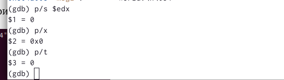

---
## Front matter
title: "Отчёт по лабораторной работе №9"
subtitle: "Дисциплина: Архитектура компьютера"
author: "Буриева Шахзода Акмаловна"

## Generic otions
lang: ru-RU
toc-title: "Содержание"

## Bibliography
bibliography: bib/cite.bib
csl: pandoc/csl/gost-r-7-0-5-2008-numeric.csl

## Pdf output format
toc: true # Table of contents
toc-depth: 2
lof: true # List of figures
lot: true # List of tables
fontsize: 12pt
linestretch: 1.5
papersize: a4
documentclass: scrreprt
## I18n polyglossia
polyglossia-lang:
  name: russian
  options:
	- spelling=modern
	- babelshorthands=true
polyglossia-otherlangs:
  name: english
## I18n babel
babel-lang: russian
babel-otherlangs: english
## Fonts
mainfont: PT Serif
romanfont: PT Serif
sansfont: PT Sans
monofont: PT Mono
mainfontoptions: Ligatures=TeX
romanfontoptions: Ligatures=TeX
sansfontoptions: Ligatures=TeX,Scale=MatchLowercase
monofontoptions: Scale=MatchLowercase,Scale=0.9
## Biblatex
biblatex: true
biblio-style: "gost-numeric"
biblatexoptions:
  - parentracker=true
  - backend=biber
  - hyperref=auto
  - language=auto
  - autolang=other*
  - citestyle=gost-numeric
## Pandoc-crossref LaTeX customization
figureTitle: "Рис."
tableTitle: "Таблица"
listingTitle: "Листинг"
lofTitle: "Список иллюстраций"
lotTitle: "Список таблиц"
lolTitle: "Листинги"
## Misc options
indent: true
header-includes:
  - \usepackage{indentfirst}
  - \usepackage{float} # keep figures where there are in the text
  - \floatplacement{figure}{H} # keep figures where there are in the text
---

# Цель работы

Приобрести навыки написания программ с использованием подпрограмм. Познакомиться с методами отладки при помощи GDB и его основными возможностями

# Теоретическое введение

Отладка — это процесс поиска и исправления ошибок в программе.
Второй этап — поиск местонахождения ошибки. Некоторые ошибки обнаружить довольно трудно. Лучший способ найти место в программе, где находится ошибка, это разбить программу на части и произвести их отладку отдельно друг от друга.
Третий этап — выяснение причины ошибки. После определения местонахождения ошибки
обычно проще определить причину неправильной работы программы.
Последний этап — исправление ошибки. После этого при повторном запуске программы,
может обнаружиться следующая ошибка, и процесс отладки начнётся заново.

Отладчики позволяют управлять ходом выполнения программы, контролировать и из-
менять данные. Это помогает быстрее найти место ошибки в программе и ускорить её
исправление. Наиболее популярные способы работы с отладчиком — это использование
точек останова и выполнение программы по шагам.
Пошаговое выполнение — это выполнение программы с остановкой после каждой строчки,
чтобы программист мог проверить значения переменных и выполнить другие действия.
Точки останова — это специально отмеченные места в программе, в которых программа-отладчик приостанавливает выполнение программы и ждёт команд.

GDB (GNU Debugger — отладчик проекта GNU) работает на многих UNIX-подобных
системах и умеет производить отладку многих языков программирования. GDB предлагает
обширные средства для слежения и контроля за выполнением компьютерных программ. Отладчик не содержит собственного графического пользовательского интерфейса и использует
стандартный текстовый интерфейс консоли. Однако для GDB существует несколько сторонних графических надстроек, а кроме того, некоторые интегрированные среды разработки
используют его в качестве базовой подсистемы отладки.
Отладчик GDB (как и любой другой отладчик) позволяет увидеть, что происходит «внутри»
программы в момент её выполнения или что делает программа в момент сбоя.

сли есть файл с исходным текстом программы, а в исполняемый файл включена информация о номерах строк исходного кода, то программу можно отлаживать, работая в отладчике
непосредственно с её исходным текстом. Чтобы программу можно было отлаживать на
уровне строк исходного кода, она должна быть откомпилирована с ключом -g.Существует два режима отображения синтаксиса машинных команд: режим Intel, используемый в том числе в NASM, и режим ATT (значительно отличающийся внешне). По умолчанию в дизассемблере GDB принят режим ATT. Переключиться на отображение команд с привычным Intel’овским синтаксисом можно, введя команду set disassembly-flavor intel.

Для продолжения остановленной программы используется команда continue (c) (gdb)
с '[аргумент]'. Выполнение программы будет происходить до следующей точки останова.
В качестве аргумента может использоваться целое число N.

Подпрограмма — это, как правило, функционально законченный участок кода, который
можно многократно вызывать из разных мест программы. В отличие от простых переходов
из подпрограмм существует возврат на команду, следующую за вызовом.
Если в программе встречается одинаковый участок кода, его можно оформить в виде
подпрограммы, а во всех нужных местах поставить её вызов. При этом подпрограмма будет содержаться в коде в одном экземпляре, что позволит уменьшить размер кода всей
программы.

Для вызова подпрограммы из основной программы используется инструкция call, которая заносит адрес следующей инструкции в стек и загружает в регистр eip адрес соответствующей подпрограммы, осуществляя таким образом переход. Затем начинается выполнение подпрограммы, которая, в свою очередь, также может содержать подпрограммы.
Подпрограмма завершается инструкцией ret, которая извлекает из стека адрес, занесённый туда соответствующей инструкцией call, и заносит его в eip. После этого выполнение
основной программы возобновится с инструкции, следующей за инструкцией call.

# Выполнение лабораторной работы

Создала каталог для программам лабораторной работы №9, перешла в него и создала файл lab09-1.asm.

{ #fig:001 width=70% }

Внимательно изучила текст программы для вычисления арифметического выражения f(x) = 2x + 7 с помощью подпрограммы _calcul.Затем ввела в файл lab09-1.asm текст программы из листинга и ввела его в файл lab09-1.asm

{ #fig:001 width=70% }

Создала исполняемый файл и запустила его.На запрос "Введите x" ввела число 6.На экран вывелось уравнение, результатом которого является число 19 при подстановке вместо x числа 6.Само выражение вычисляется в подпрограмме.

{ #fig:001 width=70% }

Изменила текст программы, добавив подпрограмму _subcalcul в подпрограмму _calcul, для вычисления выражения f(g(x)), где x вводится с клавиатуры, f(x) = 2x + 7, g(x) = 3x − 1.

{ #fig:001 width=70% }

Создала исполняемый файл и запустила его.На запрос "Введите x" ввела число 6. На экран вывелось значние 18.Получается спрева x передается в подпрограмму _calcul из нее в подпрограмму _subcalcul, где вычисляется выражение g(x), результат возвращается в _calcul и вычисляется выражение f(g(x)).

{ #fig:001 width=70% }

Создала файл lab08-2.asm для выполнения дальнейшей работы.

{ #fig:001 width=70% }

Внимательно изучила текст программы из листинга и ввела его в файл lab09-2.asm.

{ #fig:001 width=70% }

Создала исполняемый файл и запустила его.На экран вывелось сообщение "Hello, world!".

{ #fig:001 width=70% }

Для работы с GDB в исполняемый файл добавила отладочную информацию, для этого трансляцию программ  проводила с ключом
‘-g’.Загрузила исполняемый файл в отладчик gdb.

{ #fig:001 width=70% }

Проверила работу программы, запустив ее в оболочке GDB с помощью команды run (сокращённо r).
 
{ #fig:001 width=70% }

Для более подробного анализа программы установила брейкпоинт на метку _start, с которой начинается выполнение любой ассемблерной программы, и запустила её.

{ #fig:001 width=70% }

Посмотрела дисассимилированный код программы с помощью команды disassemble начиная с метки _start.

{ #fig:001 width=70% }

Переключилась на отображение команд с Intel’овским синтаксисом, введя команду set disassembly-flavor intel.

{ #fig:001 width=70% }

Различие отображения синтаксиса машинных команд в режимах ATT и Intel в том, что в представлении ATT в виде шестнадцатиричного числа записаны первые аргументы всех команд, а в представлении Intel записаны адреса вторых аргументов.

Включила режим псевдографики для более удобного анализа программы.

{ #fig:001 width=70% }

{ #fig:001 width=70% }

На предыдущих шагах была установлена точка останова по имени метки (_start). Проверила это с помощью команды info breakpoints.

{ #fig:001 width=70% }

Установила еще одну точку останова по адресу инструкции. Адрес инструкции посмотрела в средней части экрана в левом столбце.Определила адрес предпоследней инструкции (mov ebx,0x0) и установила точку останова.

{ #fig:001 width=70% }

Посмотрела информацию о всех установленных точках останова.

{ #fig:001 width=70% }
 
Посмотрела содержимого регистров с помощью команды info registers.
 
{ #fig:001 width=70% }

Посмотрела значение переменной msg1 по имени.

{ #fig:001 width=70% }

Посмотрела значение переменной msg2 по адресу. Адрес переменной  определила по дизассемблированной инструкции. Посмотрела инструкцию mov ecx,msg2 которая записывает в регистр ecx адрес перемененной msg2.

{ #fig:001 width=70% }

{ #fig:001 width=70% }

Изменила первый символ переменной msg1.

{ #fig:001 width=70% }

Изменила любой символ второй переменной msg2.

{ #fig:001 width=70% }

Вывела в различных форматах (в шестнадцатеричном формате, в двоичном формате и в символьном виде) значение регистра edx.

{ #fig:001 width=70% }

С помощью команды set изменила значение регистра ebx.

{ #fig:001 width=70% }

Завершила выполнение программы с помощью команды continue и вышла из GDB с помощью команды quit.

Скопировала файл lab8-2.asm, созданный при выполнении лабораторной работы №8, с программой выводящей на экран аргументы командной строки (Листинг 8.2) в файл с
именем lab09-3.asm.

{ #fig:001 width=70% }

Создала исполняемый файл.
 
{ #fig:001 width=70% }
 
Для загрузки в gdb программы с аргументами использовала ключ --args. Загрузила исполняемый файл в отладчик, указав аргументы.

{ #fig:001 width=70% }

Дальше исследовала расположение аргументов командной строки в стеке после запуска программы с помощью gdb.Для начала установила точку останова перед первой инструкцией в программе и запустила ее.

{ #fig:001 width=70% }

Адрес вершины стека храниться в регистре esp и по этому адресу располагается число
равное количеству аргументов командной строки (включая имя программы), проверим так ли это.

{ #fig:001 width=70% }

Посмотрела остальные позиции стека – по адесу [esp+4] располагается адрес в памяти,где находиться имя программы, по адесу [esp+8] храниться адрес первого аргумента, по аресу [esp+12] – второго и т.д.

{ #fig:001 width=70% }

Их дареса располгаются в 4 байтах друг от друга,потому что именно столько занимает элемент стека.

# Выполнение заданий для самостоятельной работы

Создала  файл lab09-4.asm для преобразования программы из лабораторной работы №8 (Задание №1 для самостоятель-
ной работы).

{ #fig:001 width=70% }

Вводя программу, изменила ее так,чтобы она вычислялась как подпрограмма.

{ #fig:001 width=70% }

Создала исполняемый файл и запустила его.

{ #fig:001 width=70% }

Создала  файл lab09-5.asm для проверки программы вычисления выражения (3 + 2) * 4 + 5.

{ #fig:001 width=70% }

Ввела текст программы из листинга для вычисления выражения (3 + 2) * 4 + 5.

{ #fig:001 width=70% }

Для работы с GDB в исполняемый файл добавила отладочную информацию, для этого трансляцию программ  проводила с ключом
‘-g’.Загрузила исполняемый файл в отладчик gdb.

{ #fig:001 width=70% }

При запуске данная программа дает неверный результат. Проверила это с помощью отладчика GDB, анализируя изменения значений регистров.

{ #fig:001 width=70% }

{ #fig:001 width=70% }

Проверив и проанализировав изменения значений регистров, нашла ошибку в следующих строчках.

{ #fig:001 width=70% }

Далее исправила текст программы правильным образом, чтобы получился верный ответ.

{ #fig:001 width=70% }

Создала исполняемый файл и запустила его. Для работы с GDB в исполняемый файл добавила отладочную информацию, для этого трансляцию программ  проводила с ключом
‘-g’.Загрузила исполняемый файл в отладчик gdb. В итоге проверила работу программы, запустив ее в оболочке GDB с помощью команды run.Изменённая программа корректна.

{ #fig:001 width=70% }

# Выводы

Приобрела навыки написания программ с использованием подпрограмм. Познакомилась с методами отладки при помощи GDB и его основными возможностями

# Список литературы{.unnumbered}

::: {#refs}
:::
