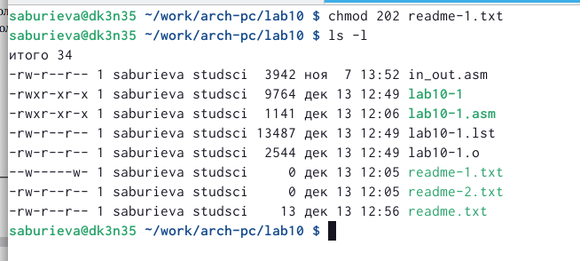

---
## Front matter
title: "Отчёт по лабораторной работе №10"
subtitle: "Дисциплина: Архитектура компьютера"
author: "Буриева Шахзода Акмаловна"

## Generic otions
lang: ru-RU
toc-title: "Содержание"

## Bibliography
bibliography: bib/cite.bib
csl: pandoc/csl/gost-r-7-0-5-2008-numeric.csl

## Pdf output format
toc: true # Table of contents
toc-depth: 2
lof: true # List of figures
lot: true # List of tables
fontsize: 12pt
linestretch: 1.5
papersize: a4
documentclass: scrreprt
## I18n polyglossia
polyglossia-lang:
  name: russian
  options:
	- spelling=modern
	- babelshorthands=true
polyglossia-otherlangs:
  name: english
## I18n babel
babel-lang: russian
babel-otherlangs: english
## Fonts
mainfont: PT Serif
romanfont: PT Serif
sansfont: PT Sans
monofont: PT Mono
mainfontoptions: Ligatures=TeX
romanfontoptions: Ligatures=TeX
sansfontoptions: Ligatures=TeX,Scale=MatchLowercase
monofontoptions: Scale=MatchLowercase,Scale=0.9
## Biblatex
biblatex: true
biblio-style: "gost-numeric"
biblatexoptions:
  - parentracker=true
  - backend=biber
  - hyperref=auto
  - language=auto
  - autolang=other*
  - citestyle=gost-numeric
## Pandoc-crossref LaTeX customization
figureTitle: "Рис."
tableTitle: "Таблица"
listingTitle: "Листинг"
lofTitle: "Список иллюстраций"
lotTitle: "Список таблиц"
lolTitle: "Листинги"
## Misc options
indent: true
header-includes:
  - \usepackage{indentfirst}
  - \usepackage{float} # keep figures where there are in the text
  - \floatplacement{figure}{H} # keep figures where there are in the text
---

# Цель работы

Приобрести навыки написания программ для работы с файлами.

# Теоретическое введение

ОС GNU/Linux является многопользовательской операционной системой. И для обеспечения защиты данных одного пользователя от действий других пользователей существуют
специальные механизмы разграничения доступа к файлам. Кроме ограничения доступа, данный механизм позволяет разрешить другим пользователям доступ данным для совместной
работы. Права доступа определяют набор действий (чтение, запись, выполнение), разрешённых
для выполнения пользователям системы над файлами. Для каждого файла пользователь
может входить в одну из трех групп: владелец, член группы владельца, все остальные. Для
каждой из этих групп может быть установлен свой набор прав доступа. Владельцем файла
является его создатель. Для предоставления прав доступа другому пользователю или другой
группе командой.

Набор прав доступа задается тройками битов и состоит из прав на чтение, запись и ис-
полнение файла. В символьном представлении он имеет вид строк rwx, где вместо любого
символа может стоять дефис. Всего возможно 8 комбинаций.В операционной системе Linux существуют различные методы управления файлами, например, такие как создание и открытие файла, только для чтения или для чтения и записи,
добавления в существующий файл, закрытия и удаления файла, предоставление прав доступа.Обработка файлов в операционной системе Linux осуществляется за счет использования
определенных системных вызовов. Для корректной работы и доступа к файлу при его открытии или создании, файлу присваивается уникальный номер (16-битное целое число) –
дескриптор файла.

Для записи в файл служит системный вызов sys_write, который использует следующие
аргументы: количество байтов для записи в регистре EDX, строку содержимого для записи
ECX, файловый дескриптор в EBX и номер системного вызова sys_write (4) в EAX.
Системный вызов возвращает фактическое количество записанных байтов в регистр EAX.
В случае ошибки, код ошибки также будет находиться в регистре EAX.
Прежде чем записывать в файл, его необходимо создать или открыть, что позволит получить дескриптор файла.Для чтения данных из файла служит системный вызов sys_read, который использует
следующие аргументы: количество байтов для чтения в регистре EDX, адрес в памяти для
записи прочитанных данных в ECX, файловый дескриптор в EBX и номер системного вызова
sys_read (3) в EAX. Как и для записи, прежде чем читать из файла, его необходимо открыть,
что позволит получить дескриптор файла.

Для изменения содержимого файла служит системный вызов sys_lseek, который использует следующие аргументы: исходная позиция для смещения EDX, значение смещения в
байтах в ECX, файловый дескриптор в EBX и номер системного вызова sys_lseek (19) в EAX.

# Выполнение лабораторной работы

Создала каталог для программам лабораторной работы № 10, перешла в него и
создала файлы lab10-1.asm, readme-1.txt и readme-2.txt.

{ #fig:001 width=70% }

Ввела в файл lab10-1.asm текст программы из листинга 10.1.

{ #fig:001 width=70% }

Создала файлreadme.txt для дальнейшей работы.

{ #fig:001 width=70% }

Создала исполняемый файл и запустила его.

{ #fig:001 width=70% }

С помощью команды chmod изменила права доступа к исполняемому файлу lab10-1,запретив его выполнение.Попыталась выполнить файл. В данном случае запретив выполнение получается то, что его исполнение невозможно.

{ #fig:001 width=70% }

С помощью команды chmod изменила права доступа к файлу lab10-1.asm с исходным текстом программы, добавив права на исполнение. Попыталась выполнить его. В данном случае при исполнении можно увидеть много ошибок, потому что этот файл не предназначен для данного случая использования.

{ #fig:001 width=70% }

В соответствии с вариантом 4 в таблице 10.4 предоставила права доступа к файлу readme-1.txt представленные в символьном виде. Проверила правильность выполнения с помощью команды ls -l

{ #fig:001 width=70% }

Потом в соответствии с вариантом 4 в таблице 10.4 предоставила права доступа к файлу readme-2.txt представленные в двоичном виде. Проверила правильность выполнения с помощью команды ls -l

{ #fig:001 width=70% }

# Выполнение заданий для самостоятельного выоплнения

Сперва создала файлы с именем name.txt и name.nasm

{ #fig:001 width=70% }

Написала в файл name.asm текст программы работающему по алгоритму, которая вывод на экран вопрос "Как Вас зовут?"

{ #fig:001 width=70% }

Создала исполняемый файл и запустила его. На запрос "Как Вас зовут" я ввела с клавиатуры свою фамилию и имя.Потом с помощью команды cat вывела на экран сообщение "Меня зовут Буриева Шахзода".

{ #fig:001 width=70% }

# Выводы

Приобрела навыки написания программ для работы с файлами.

# Список литературы{.unnumbered}

::: {#refs}
:::
